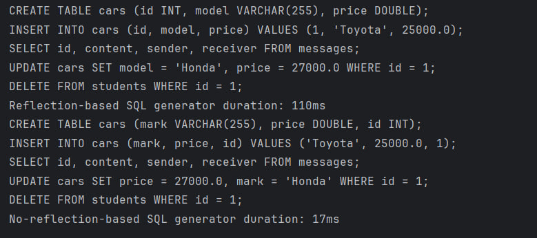

# java-advanced-lab2

## Автор: Величко Максим, ІО-25

## Завдання
Визначити C3 як остачу від ділення номеру залікової книжки студента/студентки на 3.

2505 % 3 = 0

## Опис проєкту

Цей проєкт демонструє реалізацію генерації SQL-запитів за допомогою рефлексії та без її використання.
Реалізація дозволяє визначати мапінг полів Java-об'єкта з колонками таблиці бази даних через анотації.
Це дозволяє автоматизувати процес генерації SQL-запитів для створення, вставки, вибірки, оновлення та
видалення даних.

## Основні класи

### `Table`

Анотація класу, яка визначає відповідність між класом Java та таблицею в базі даних. Приймає
параметр `name`, що задає назву таблиці.

### `Column`

Анотація для полів класу, що визначає відповідність між полем Java-об'єкта та колонкою в таблиці
бази даних. Приймає параметр `name`, який задає назву колонки.

### `Id`

Анотація для полів класу, що визначає первинний ключ таблиці бази даних.

### `SQLGenerator`

Клас, що забезпечує генерацію SQL-запитів за допомогою рефлексії. Методи:

- `generateCreateQuery(Class<?> clazz)` — генерує SQL-запит для створення таблиці.
- `generateInsertQuery(Object obj)` — генерує SQL-запит для вставки даних.
- `generateSelectQuery(Class<?> clazz)` — генерує SQL-запит для вибірки даних.
- `generateUpdateQuery(Object obj)` — генерує SQL-запит для оновлення даних.
- `generateDeleteQuery(Class<?> clazz, Object id)` — генерує SQL-запит для видалення даних.

### `NoReflectionSQLGenerator`

Клас, що забезпечує генерацію SQL-запитів без використання рефлексії. Методи:

- `createTable(String tableName, Map<String, String> columns)` — генерує SQL-запит для створення
  таблиці.
- `insert(String tableName, Map<String, Object> values)` — генерує SQL-запит для вставки даних.
- `select(String tableName, String... columns)` — генерує SQL-запит для вибірки даних.
- `update(String tableName, Map<String, Object> values, String condition)` — генерує SQL-запит для
  оновлення даних.
- `delete(String tableName, String condition)` — генерує SQL-запит для видалення даних.

## Очікувані результати

Серіалізація через рефлексію буде повільнішою, ніж серіалізація без рефлексії.
### Скріншот результату:


## Збірка та запуск

### Вимоги

- Apache Maven 3.8.4 або вище

### Інструкція зі збірки та запуску

1. **Клонуйте репозиторій собі на комп'ютер**:
    ```bash
    git clone https://github.com/makssvelichko/java-advanced-lab2.git
    ```

2. **Збірка проєкту**:
   Перейдіть у кореневу теку та завантажте залежності:
   ```bash
   mvn dependency:resolve
   ```

3. **Запуск проекту**:
  - Запустіть головний клас `Main`.